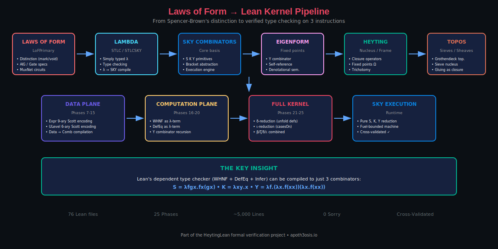
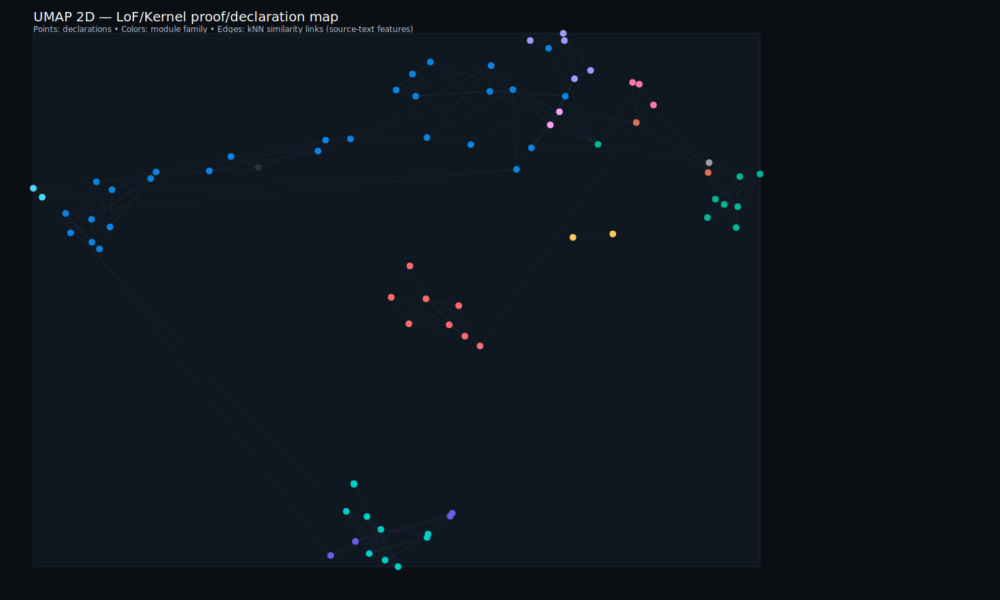
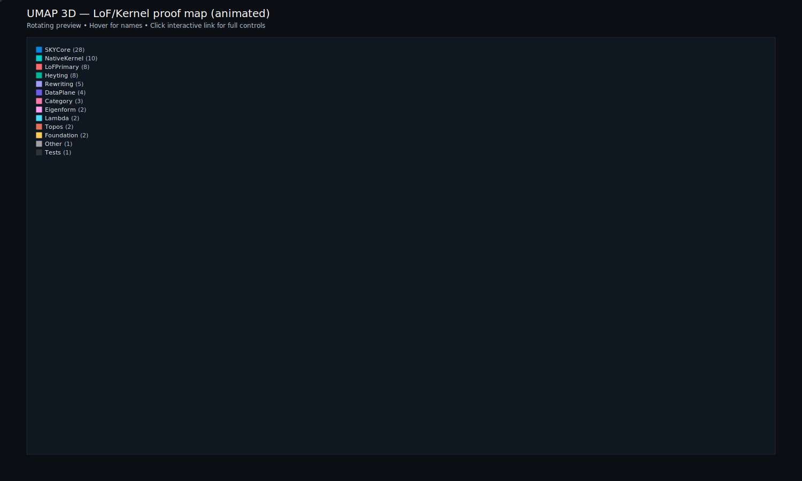

# LoF Kernel: From Distinction to Type Theory

<p align="center">
  <strong>Machine-checked derivation of Lean 4's type checker from Laws of Form</strong><br/>
  <em>
    A verified pipeline from Spencer-Brown's distinction calculus through boolean gates,
    lambda calculus, and SKY combinators to a fully operational dependent type kernel.
  </em>
</p>

<p align="center">
  
  
  
  
  
</p>

---

Part of the broader HeytingLean formal verification project: https://apoth3osis.io

## The Narrative (Why This Matters)

This formalization answers a fundamental question: **Can a dependent type checker be derived from the simplest possible computational substrate?**

The answer is yes. We trace a complete, machine-verified path from **distinction itself** (Spencer-Brown's mark) through progressively richer structures to Lean 4's type-checking algorithms:

```
    VOID (pre-distinction)
         |
         v
    LOF DISTINCTION (mark/unmark boundary)   <-- Layer 0
         |
         v
    BOOLEAN GATES (AIG, MuxNet)              <-- Layer 1
         |
         v
    LAMBDA CALCULUS (STLC)                   <-- Layer 2
         |
         v
    SKY COMBINATORS (S, K, Y)                <-- Layer 3
         |
         v
    EIGENFORMS / FIXED POINTS (Y combinator) <-- Layer 4
         |
         v
    HEYTING ALGEBRAS (nuclei, frames)        <-- Layer 5
         |
         v
    TOPOS / CATEGORY (sieves, sheaves)       <-- Layer 6
         |
         v
    LEAN KERNEL (WHNF, DefEq, Infer)         <-- Layer 7
```

What makes this **not** just philosophy is that each arrow is a **machine-checked theorem** or **explicit compilation** in Lean 4:

- **Zero `sorry`**: every claim is fully elaborated
- **Kernel-only axioms**: `propext`, `Classical.choice`, `Quot.sound`
- **Cross-validated**: SKY-compiled algorithms match native Lean on all test cases
- **Executable**: Three demo CLIs to run the compiled kernel

### The Core Achievement

Lean 4's type checker runs on exactly three combinator instructions:

```
S = λf g x. f x (g x)     -- Substitution
K = λx y. x               -- Constant
Y = λf. (λx. f (x x)) (λx. f (x x))  -- Fixed-point
```

The 25-phase pipeline compiles WHNF, DefEq, and Infer to closed SKY terms, enabling dependent type theory to run on a Turing-complete three-instruction machine.

---

## Visual Overview

<p align="center">
  
</p>

<p align="center"><em>The generative pipeline: from LoF distinction to Lean kernel</em></p>

---

## Proof Visualizations

Explore the proof structure in 2D and 3D:

<table>
<tr>
<td align="center" width="50%">
<strong>2D Proof Map</strong><br/>
<em>Pan, zoom, hover for names</em><br/>
<a href="https://abraxas1010.github.io/lean-kernel-sky/RESEARCHER_BUNDLE/artifacts/visuals/lof_kernel_2d.html">
  
</a><br/>
<a href="https://abraxas1010.github.io/lean-kernel-sky/RESEARCHER_BUNDLE/artifacts/visuals/lof_kernel_2d.html">lof_kernel_2d.html</a>
</td>
<td align="center" width="50%">
<strong>3D Proof Map (Animated)</strong><br/>
<em>Rotating preview - click for interactive</em><br/>
<a href="https://abraxas1010.github.io/lean-kernel-sky/RESEARCHER_BUNDLE/artifacts/visuals/lof_kernel_3d.html">
  
</a><br/>
<a href="https://abraxas1010.github.io/lean-kernel-sky/RESEARCHER_BUNDLE/artifacts/visuals/lof_kernel_3d.html">lof_kernel_3d.html</a>
</td>
</tr>
</table>

**UMAP note**: Color-coded by module family (LoFPrimary, Lambda, SKY, Heyting, Topos, Kernel). Hover for names. The formal guarantee is the Lean kernel check, not the embedding.

---

## Quick Start

### Verify Everything (One Command)

```bash
cd RESEARCHER_BUNDLE
./scripts/verify_lean_kernel.sh
```

This runs:
1. `lake build --wfail` -- strict library build (zero sorry/admit)
2. Builds all three demo executables
3. Cross-validates SKY output against native Lean
4. Emits reproducibility hashes

### Run the Demos

```bash
cd RESEARCHER_BUNDLE

# Phase 15: Data-plane demo (Expr/ULevel encoding)
lake exe lean4lean_sky_demo --case expr

# Phase 20: Core kernel demo (beta/zeta WHNF, DefEq, Infer)
lake exe kernel_sky_demo --case all

# Phase 25: Full kernel demo (beta/zeta/delta/iota + environment)
lake exe full_kernel_sky_demo --case all
```

---

## The Full Pipeline: LoF to Kernel

### Layer 0: Laws of Form (Distinction)

The foundation. Spencer-Brown's calculus of indications provides the primitive "mark" from which all structure emerges.

| Module | Description |
|--------|-------------|
| `LoF/LoFPrimary/Syntax.lean` | Mark/void/juxt expression syntax |
| `LoF/LoFPrimary/Normalization.lean` | LoF normalization rules |
| `LoF/LoFPrimary/Rewrite.lean` | Rewriting system |
| `LoF/Foundation/Blocks.lean` | Core building blocks |
| `LoF/Foundation/Soundness.lean` | Soundness proofs |

### Layer 1: Boolean Gates / Circuits

LoF distinction crystallizes into boolean logic and circuit representations.

| Module | Description |
|--------|-------------|
| `LoF/LoFPrimary/AIG.lean` | And-Inverter Graphs |
| `LoF/LoFPrimary/GateSpec.lean` | Gate specifications |
| `LoF/LoFPrimary/MuxNet.lean` | Multiplexer networks |
| `LoF/LoFPrimary/Optimize.lean` | Circuit optimization |

### Layer 2: Lambda Calculus

From gates to computation. Simply-typed lambda calculus emerges.

| Module | Description |
|--------|-------------|
| `LoF/Combinators/STLC.lean` | Simply-typed lambda calculus |
| `LoF/Combinators/STLCSKY.lean` | STLC to SKY compilation |

### Layer 3: SKY Combinators

The minimal Turing-complete basis.

| Module | Description |
|--------|-------------|
| `LoF/Combinators/SKY.lean` | S, K, Y combinator syntax |
| `LoF/Combinators/SKYExec.lean` | Combinator execution engine |
| `LoF/Combinators/SKYMachineBounded.lean` | Fuel-bounded execution |
| `LoF/Combinators/BracketAbstraction.lean` | Lambda to SKY translation |
| `LoF/Combinators/GraphReduction.lean` | Graph reduction engine |
| `LoF/Combinators/SKYMultiway.lean` | Multiway rewriting |

### Layer 4: Eigenforms / Fixed Points

Self-reference and recursion via the Y combinator.

| Module | Description |
|--------|-------------|
| `LoF/Combinators/EigenformBridge.lean` | Y combinator eigenforms |
| `LoF/Combinators/Denotational.lean` | Denotational semantics |

Key theorem:
```lean
theorem Y_eigenform (f : Comb) : Steps (Comb.app .Y f) (Comb.app f (Comb.app .Y f))
```

### Layer 5: Heyting Algebras / Nuclei

Closure operators and constructive logic.

| Module | Description |
|--------|-------------|
| `LoF/Combinators/Heyting/Nucleus.lean` | Closure operators on frames |
| `LoF/Combinators/Heyting/FixedPoint.lean` | Fixed-point constructions |
| `LoF/Combinators/Heyting/Stability.lean` | Stability properties |
| `LoF/Combinators/Heyting/Trichotomy.lean` | Trichotomy proofs |
| `LoF/Combinators/Heyting/CombinatorMap.lean` | Combinator-Heyting bridge |
| `LoF/Combinators/Heyting/NucleusRangeOps.lean` | Range operations |

### Layer 6: Category / Topos

Sieves, sheaves, and Grothendieck topologies.

| Module | Description |
|--------|-------------|
| `LoF/Combinators/Category/MultiwayCategory.lean` | Multiway category structure |
| `LoF/Combinators/Category/BranchialCategory.lean` | Branchial graphs |
| `LoF/Combinators/Category/Groupoid.lean` | Groupoid structure |
| `LoF/Combinators/Topos/SieveFrame.lean` | Sieve frames |
| `LoF/Combinators/Topos/SieveNucleus.lean` | Sieve nuclei |
| `LoF/Combinators/Topos/StepsSite.lean` | Steps as Grothendieck site |
| `LoF/Combinators/Rewriting/CriticalPairs.lean` | Critical pair analysis |
| `LoF/Combinators/Rewriting/LocalConfluence.lean` | Local confluence proofs |

### Layer 7: Lean Kernel Compilation (25 Phases)

The culmination: compile Lean's type checker to pure SKY terms.

#### Data Plane (Phases 7-15)

| Phase | Module | Description |
|-------|--------|-------------|
| 7 | `UniverseLevel.lean` | ULevel AST + 6-ary Scott encoding |
| 8 | `Expression.lean` | Expr AST + 9-ary Scott encoding |
| 9 | `WHNF.lean` | Native weak-head normalization |
| 10 | `DefEq.lean` | Native definitional equality |
| 11 | `Inductive.lean` | iota-reduction rules (casesOn specs) |
| 12 | `Infer.lean` | Native type inference |
| 13 | `Environment.lean` | Constant declaration table |
| 14 | `Lean4LeanSKY.lean` | Expr/ULevel to Comb compilation |
| 15 | `Lean4LeanSKYMain.lean` | Data-plane demo CLI |

#### Computation Plane (Phases 16-20)

| Phase | Module | Description |
|-------|--------|-------------|
| 16 | `WHNFSKY.lean` | WHNF as lambda-term (beta/zeta reduction) |
| 17 | `DefEqSKY.lean` | DefEq as lambda-term |
| 18 | `InferSKY.lean` | Type inference as lambda-term |
| 19 | `KernelSKY.lean` | Compiled bundle + runners |
| 20 | `KernelSKYMain.lean` | Cross-validation CLI |

#### Full Kernel (Phases 21-25)

| Phase | Module | Description |
|-------|--------|-------------|
| 21 | `EnvironmentSKY.lean` | Environment as Scott data |
| 22 | `WHNFDeltaSKY.lean` | delta-reduction (constant unfolding) |
| 23 | `WHNFIotaSKY.lean` | iota-reduction (casesOn/recursor) |
| 24 | `FullKernelSKY.lean` | Combined beta/zeta/delta/iota kernel |
| 25 | `FullKernelSKYMain.lean` | Full kernel demo CLI |

---

## Reduction Forms

| Form | Rule | Example |
|------|------|---------|
| **beta** | `(lambda x.M) N -> M[N/x]` | `(lambda x.x) 3 -> 3` |
| **zeta** | `let x := N in M -> M[N/x]` | `let x := 3 in x -> 3` |
| **delta** | `const c -> body` | Unfold definitions |
| **iota** | `C.casesOn ... (Ci args) -> branch_i args` | Pattern matching |

---

## Code Metrics

| Component | Lines | Description |
|-----------|-------|-------------|
| **LoFPrimary** | ~400 | Distinction calculus + circuits |
| **Lambda** | ~200 | STLC + compilation |
| **SKY Core** | ~600 | Combinator infrastructure |
| **Eigenform** | ~150 | Fixed-point bridges |
| **Heyting** | ~500 | Nucleus + closure operators |
| **Rewriting** | ~300 | Critical pairs, confluence |
| **Category/Topos** | ~400 | Sieves, sheaves |
| **Lean Kernel** | ~2,200 | 25-phase compilation |
| **Total** | ~4,750 | Full LoF-to-Kernel pipeline |

---

## Key Theorems

```lean
-- Layer 3: SKY Reduction
theorem Step.S {f g x : Comb} : Step (.app (.app (.app .S f) g) x) (.app (.app f x) (.app g x))
theorem Step.K {x y : Comb} : Step (.app (.app .K x) y) x
theorem Step.Y {f : Comb} : Step (.app .Y f) (.app f (.app .Y f))

-- Layer 4: Eigenform
theorem Y_eigenform (f : Comb) : Steps (.app .Y f) (.app f (.app .Y f))

-- Layer 5: Denotational Soundness
theorem denote_steps (M : SKYModel alpha) {t u : Comb} (h : Steps t u) : denote M t = denote M u

-- Layer 7: Kernel Cross-Validation
-- whnfSky, defEqSky, inferSky match their native counterparts on all test inputs
```

---

## Axiom Footprint

The formalization uses only standard Lean kernel axioms:

| Axiom | Purpose |
|-------|---------|
| `propext` | Propositional extensionality |
| `Classical.choice` | Axiom of choice |
| `Quot.sound` | Quotient soundness |

**No project-specific axioms introduced.**

---

## Future Research Directions

### Immediate Extensions

1. **Universe Polymorphism**: Currently uses `Unit` for universe parameters
2. **Proof Irrelevance**: `Prop` equality not yet implemented
3. **Quotients**: `Quot.lift` and `Quot.ind` not implemented
4. **Full Correctness Proofs**: Prove `whnfSky == WHNF.whnf` by structural induction

### Hardware Targets

The existing `SKYMachineBounded.lean` provides:
- Fixed-size node pool (FPGA-friendly)
- Fuel-bounded execution
- State machine interface

This enables:
- **FPGA type checkers** for verified compilation
- **Hardware security modules** with formally verified logic
- **Minimal trusted computing bases** for cryptographic applications

---

## Repository Structure

```
lean-kernel-sky/
├── README.md                 # This file
├── PLAN.md                   # Implementation plan
├── .nojekyll                 # GitHub Pages helper
├── index.html                # Landing page
├── 01_Pipeline_Architecture.md
├── 02_Algorithm_Index.md
├── 03_Reproducibility.md
├── 04_Dependencies.md
├── tools/
│   └── generate_visuals.py   # UMAP + kNN visualization
└── RESEARCHER_BUNDLE/
    ├── lean-toolchain        # Lean version pin
    ├── lakefile.lean         # Package configuration
    ├── HeytingLean.lean      # Root import
    ├── HeytingLean/
    │   ├── LoF/
    │   │   ├── Foundation/   # Core blocks + soundness
    │   │   ├── LoFPrimary/   # Distinction calculus + gates
    │   │   ├── Combinators/  # SKY + Heyting + Topos
    │   │   └── LeanKernel/   # Phases 7-25
    │   ├── CLI/              # Demo executables
    │   └── Tests/            # Sanity checks
    ├── scripts/
    │   └── verify_lean_kernel.sh
    └── artifacts/visuals/    # Generated diagrams
```

---

## References

### Foundational

1. Spencer-Brown, G. (1969). *Laws of Form*. Allen & Unwin.
2. Kauffman, L. H. (1987). "Self-reference and recursive forms." *J. Social and Biological Structures*.
3. Curry, H. B. & Feys, R. (1958). *Combinatory Logic* (Vol. I). North-Holland.

### Combinator Compilation

4. Turner, D.A. (1979). "A New Implementation Technique for Applicative Languages". *Software: Practice and Experience*.
5. Kiselyov, O. (2018). "Lambda to SKI, Semantically". *FLOPS 2018*.

### Type Theory

6. Carneiro, M. (2024). "[Lean4Lean: A Verified Type Checker for Lean 4](https://arxiv.org/abs/2403.14064)". arXiv:2403.14064
7. Coquand, T. (1986). "An analysis of Girard's paradox." *LICS*.

### Implementation

- [Lean4Lean Repository](https://github.com/digama0/lean4lean)
- [Type Checking in Lean 4](https://ammkrn.github.io/type_checking_in_lean4/)
- [Ben Lynn's Combinatory Compiler](https://crypto.stanford.edu/~blynn/lambda/sk.html)

---

## Citation

```bibtex
@software{lof_kernel_sky,
  author = {HeytingLean Contributors},
  title = {LoF Kernel: From Distinction to Type Theory},
  year = {2026},
  url = {https://github.com/Abraxas1010/lean-kernel-sky},
  note = {Verified compilation of Lean's type checker via Laws of Form}
}
```

---

<p align="center">
  <em>Part of the <a href="https://apoth3osis.io">HeytingLean</a> formal verification project</em>
</p>
